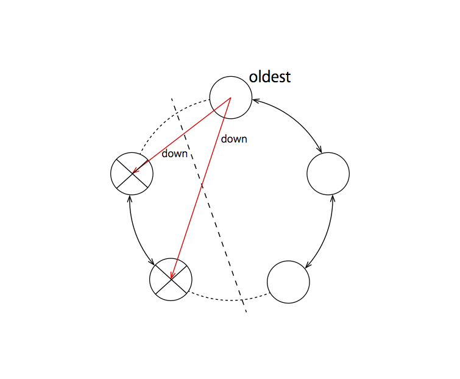
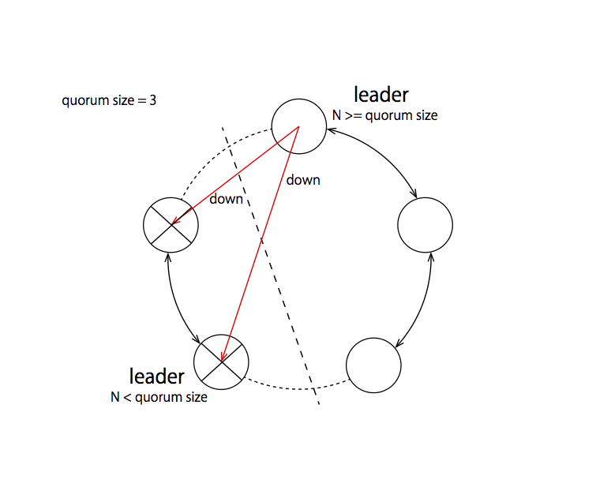

#  akka-cluster-custom-downing
[](https://circleci.com/gh/TanUkkii007/akka-cluster-custom-downing)

## Introduction

Akka cluster has an `akka.cluster.auto-down-unreachable-after` configuration property.
It enables marking unreachable nodes as DOWN automatically after a specified duration.
As [the Akka documentation](http://doc.akka.io/docs/akka/current/scala/cluster-usage.html#Automatic_vs__Manual_Downing) says, 
using the auto-down feature is dangerous because it may cause a split-brain scenario which leads to multiple clusters.
The fundamental problem is that an actual down node and a temporary network partition cannot be distinguished from each other.
You must realize that an auto-downed node may be actually alive and establishing its own cluster.  One of the worst consequences is that resources that must not be shared are now accessible by multiple Cluster Singletons or duplicatively sharded by Cluster Sharding.

akka-cluster-custom-downing provides a configurable auto-downing strategy that you can choose based on your distributed application design.
It lets you configure which nodes can be downed automatically and who is responsible to execute a downing action.

## Theoretical background

It is noteworthy that there exists **no** perfect split brain resolving strategy. 
According to so called "FLP impossibility result", no deterministic consensus can be made in an asynchronous system even if only one process fails.
As you know, akka cluster is an asynchronous system and therefore cannot make a consensus about its view synchronised with gossip protocol if faulty processes exist.

It is always beneficial to clarify what kind of failure a distributed algorithm handles.
Akka cluster has a failure detector and a split brain resolver (and also auto-down) handles its failure.
In this case the failure indicates the process crashes and does not differentiate a crash from the omission of a heartbeat.
Actually the failure detector cannot differentiate a crash and the omission of a heartbeat. 
In the case of omission, i.e. when the process marked as faulty by the failure detector are actually alive, some algorithms go wrong.
For example the auto-down feature of akka cluster is based on election of a leader which may diverge under an omission fault, so may result in a split-brain scenario.

Note that leader election in Akka cluster is based on asynchronously replicated state.
A leader is the first member selected from sorted members that are not unreachable.
Under network partition some partition may have different view of unreachable members from the others so leader will diverge.

The Split brain resolver included in akka-cluster-custom-downing basically resolves the problem in a way that,

1. do not depends on a leader (or leader only)
1. force some resolved processes to crash, i.e. omission fault is same as crash fault
1. not perfect as indicated in FLP impossibility, but occurrence of the imperfection is pretty rare

My slide may help you understand these things. I am sorry it is written in japanese. Let me know if there are better documents that explain the split brain problem.
http://www.slideshare.net/TanUkkii/akka-cluster-66880662

## Status

akka-cluster-custom-downing is currently under development.

akka-cluster-custom-downing is for general purpose.
In some case you find it is better to implement your system specific strategy by yourself.
akka-cluster-custom-downing shows how to implement split brain resolving strategies so may be your help.

Distributed systems are challenging. Actually I do not use akka cluster or akka-cluster-custom-downing in production.
I hope to know how you use them.

## Installation

For sbt, add following lines to build.sbt.

```
resolvers += Resolver.bintrayRepo("tanukkii007", "maven")

libraryDependencies += "com.github.TanUkkii007" %% "akka-cluster-custom-downing" % "0.0.9"
```

Both Scala 2.11 and 2.12 are supported.

## Usage of split brain resolving strategy

### OldestAutoDowning

`OldestAutoDowning` automatically downs unreachable members.
A node responsible to down is the oldest member of a specified role.
If `oldest-member-role` is not specified, the oldest member among all cluster members fulfills its duty.

You can enable this strategy with following configuration.

```
akka.cluster.downing-provider-class = "tanukki.akka.cluster.autodown.OldestAutoDowning"

custom-downing {
  stable-after = 20s
  
  oldest-auto-downing {
    oldest-member-role = ""
    down-if-alone = true
  }
}
```

Unlike leader based downing strategy, the oldest based downing strategy is much safer.
It is because the oldest member is uniquely determined by all members even if gossip is not converged, 
while different leader might be viewed by members under gossip unconvergence.

Downside of the oldest based downing strategy is loss of downing functionality when the oldest member itself fails.
If `down-if-alone` is set to be true, such scenario can be avoided because the secondary oldest member will down the oldest member if the oldest member get unreachable alone.



### QuorumLeaderAutoDowning

`QuorumLeaderAutoDowning` automatically downs unreachable nodes after specified duration if the number of remaining members are larger than or equal to configured `quorum size`.
This strategy is same as [static quorum](http://doc.akka.io/docs/akka/rp-15v09p02/scala/split-brain-resolver.html#Static_Quorum) strategy of Split Brain Resolver from Typesafe reactive platform.
If `down-if-out-of-quorum` is set to be true, remaining members which number is under quorum size will shutdown ActorSystem by themselves.
If `role` is specified, the number of remaining members in the role is used to be compared with quorum size.

```scala

akka.cluster.downing-provider-class = "tanukki.akka.cluster.autodown.QuorumLeaderAutoDowning"

custom-downing {
  stable-after = 20s
  
  quorum-leader-auto-downing {
    role = ""
    quorum-size = 0
    down-if-out-of-quorum = true
  }
}

```



### MajorityLeaderAutoDowning

`MajorityLeaderAutoDowning` is similar to `QuorumLeaderAutoDowning`. However, instead of a static specified quorum size this strategy automatically keeps the partition with the largest amount of nodes. If the partitions are of equal size, the partition that contains the node with the globally lowest address is kept. The strategy is the same as the [keep majority](http://doc.akka.io/docs/akka/rp-15v09p02/scala/split-brain-resolver.html#Keep_Majority) strategy of Split Brain Resolver from Typesafe reactive platform.
If a role is set by `majority-member-role`, the strategy is only enforced to the nodes with the specified role.

```scala

akka.cluster.downing-provider-class = "tanukki.akka.cluster.autodown.MajorityLeaderAutoDowning"

custom-downing {
  stable-after = 20s

  majority-leader-auto-downing {
    majority-member-role = ""
    down-if-in-minority = true
    shutdown-actor-system-on-resolution = true
  }
}

```


## Usage of Leader based downing strategies

It is not recommended that your auto-down strategy depends on a leader.

With careful consideration, however you may use auto-down feature safely for a specific design of distributed application.

If following conditions are met, nodes can be safely down automatically.

1. a node will be isolated from incoming requests if the node is detached from the other cluster members
1. a node mutates shared resources only if it receives a request

How this conditions are applied is vary according to application design.


### LeaderAutoDowningRoles

`LeaderAutoDowningRoles` automatically downs nodes with specified roles.
Like `akka.cluster.AutoDowning`, which is provided with Akka Cluster, a node responsible to down is the leader.

You can enable this strategy with following configuration.

```
akka.cluster.downing-provider-class = "tanukki.akka.cluster.autodown.LeaderAutoDowningRoles"

custom-downing {
  stable-after = 20s

  leader-auto-downing-roles {
    target-roles = [worker]
  }
}
```


### RoleLeaderAutoDowningRoles

`RoleLeaderAutoDowningRoles` automatically downs nodes with specified roles.
A node responsible to down is the role leader of a specified role.

You can enable this strategy with following configuration.

```
akka.cluster.downing-provider-class = "tanukki.akka.cluster.autodown.RoleLeaderAutoDowningRoles"

custom-downing {
  stable-after = 20s
  
  role-leader-auto-downing-roles {
    leader-role = "master"
    target-roles = [worker]
  }
}
```
